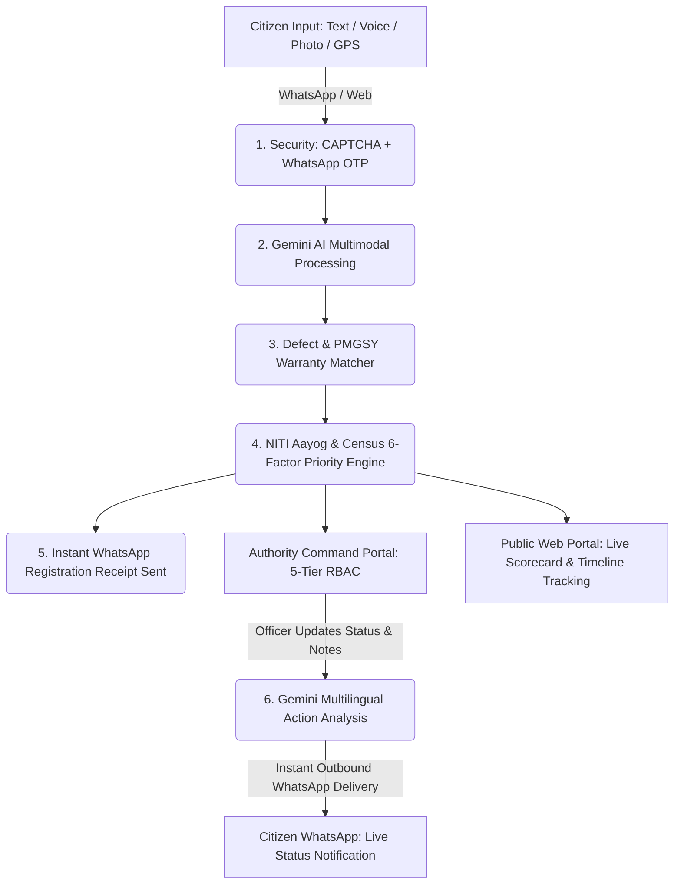

# JanSetu AI — Citizen Development Intelligence & Priority Platform

**A Multilingual, Multimodal Digital Public Infrastructure (DPI) for Government Adoption**

[](https://opensource.org/licenses/MIT)
[](https://nodejs.org/)
[](https://ai.google.dev/)
[](#-governance--licensing-model)

---

## 🇮🇳 Executive Overview

**JanSetu AI** (ಜನಸೇತು / जनसेतु) is a state-and-national-level **Digital Public Infrastructure (DPI)** designed to bridge the critical gap between citizen-reported civic grievances and evidence-backed public investment allocation.

Citizens report civic defects and development needs via **WhatsApp** or the **Citizen Web Portal** using regional languages (Kannada, Hindi, English, Tamil, Telugu, Marathi, and 10+ Indian languages) across **Text, Voice Notes, Photos, and GPS Locations**. **JanSetu AI** fuses these citizen signals with real national datasets — including **PMGSY (Pradhan Mantri Gram Sadak Yojana)** rural road records, **Census 2011 & SECC** demographic vulnerability matrices, and **NITI Aayog Aspirational Districts** deprivation scores — to identify infrastructure hotspots and calculate an **Explainable 6-Factor Priority Score** for government authorities from Field Engineers to National Policymakers.

---

## 🚀 Key Features

### 1. 📲 Multimodal Citizen Intake (WhatsApp Bot + Web Portal)
- **Voice-First Accessibility**: Voice note transcription and understanding powered by **Gemini AI** with automatic language detection (Kannada, Hindi, English, etc.).
- **Photo Evidence & AI Damage Analysis**: Analyzes defect severity, hazard level, and road/water damage automatically.
- **Location Pinpoint**: Instant GPS reverse geocoding with OpenStreetMap Nominatim and Local Government Directory (LGD) mapping.
- **Instant WhatsApp Registration Receipts**: Real-time receipt message delivered to WhatsApp containing ticket reference (`JS-2026-XXXXX`), category, location, and tracking links.
- **Real-Time WhatsApp Status Updates**: When officers take action or write notes on the Authority Portal, Gemini AI generates a multilingual explanation and delivers it instantly to the citizen's WhatsApp.
- **Unified Request Tracking**: Complaints submitted via WhatsApp and Web Portal appear together under the citizen's authenticated *"My Submitted Requests"* dashboard.

### 2. 🛡️ DPI Security & Identity
- **Interactive Visual Canvas CAPTCHA**: Dynamic alphanumeric security verification on Sign In and Registration to prevent bot spam and DDoS attacks.
- **WhatsApp OTP Phone Verification**: 6-digit cryptographic OTP sent directly to the citizen's WhatsApp to verify phone ownership during registration.
- **Passwordless WhatsApp Login**: One-tap sign in using a WhatsApp OTP code.
- **All-India Cascading Dropdowns**: Covers all **28 States and 8 Union Territories** with dynamically populated district lists.

### 3. ⚖️ Explainable 6-Factor Priority Engine
Ranks civic hotspots using a transparent, 100-point formula with full source attribution:

$$\text{Priority Score} = 0.30(D) + 0.20(P) + 0.20(I) + 0.15(S) + 0.10(U) + 0.05(E)$$

| Factor | Weight | Source / Evidence Basis |
|---|---|---|
| **Citizen Demand ($D$)** | **30%** | Normalized signal density per locality |
| **Population Affected ($P$)** | **20%** | Census 2011 / SECC village population count |
| **Infrastructure Gap ($I$)** | **20%** | NITI Aayog Aspirational District Deprivation Score (with source attribution) |
| **Severity ($S$)** | **15%** | Gemini AI damage assessment & disruption tier |
| **Urgency / Surge ($U$)** | **10%** | 60-day surge velocity in citizen signals |
| **Evidence Confidence ($E$)** | **5%** | Multimodal evidence verification (Text + Image + Voice + GPS) |

### 4. 🏛️ Authority Command Dashboard & 5-Tier RBAC
- **Tier 1: Field Officer (AEE)**: Ground inspection, GPS verification, status updates.
- **Tier 2: Department Officer (EE)**: Departmental resource allocation, contractor notices.
- **Tier 3: District Authority (DC/DM)**: District heatmaps, budget allocation, officer provisioning.
- **Tier 4: State Authority (Secretary)**: State-wide infrastructure tracking, inter-district prioritization.
- **Tier 5: National Policymaker (Ministry)**: National rollups, aspirational district monitoring.
- **Interactive Light Map & Google Maps Navigation**: Real-time Leaflet map with one-click Google Maps navigation for on-ground inspection.
- **Government Officer Provisioning Ledger**: In-portal officer allocation and credential management.

---

## 🔄 Core Loop & System Flow



---

## 🛠️ Project Structure

```
jansetu-ai/
├── whatsapp-bot/             ← Citizen WhatsApp Intake Bot (Node.js + whatsapp-web.js + Gemini)
│   ├── bot/                  ← WhatsApp connection, QR handler, outbound delivery engine
│   ├── routes/               ← Outbound status notifications & WhatsApp OTP endpoints
│   ├── services/             ← Gemini multimodal dialogue & conversational session state
│   └── server.js             ← WhatsApp Bot microservice (Port 3001)
├── backend/                  ← Core REST API Engine (Node.js + Express)
│   ├── src/
│   │   ├── routes/           ← Signals, Issues, Analytics, Copilot, Auth (OTP + CAPTCHA)
│   │   ├── services/
│   │   │   ├── ai/           ← Gemini AI classifier, speech service, 6-Factor priority engine
│   │   │   ├── data/         ← Central DB service, National GeoService, NITI Aayog service
│   │   │   ├── matching/     ← PMGSY Warranty Defect Matcher
│   │   │   ├── escalation/   ← Auto-escalation SLA engine
│   │   │   └── notifications/← Notification dispatcher
│   │   ├── middleware/       ← JWT Auth, RBAC, Rate limiting, Uploads
│   │   └── config/           ← Escalation rules & environment settings
│   ├── data/                 ← JSON persistence (signals.json, users.json, issues.json)
│   └── server.js             ← Backend API server (Port 5000)
├── public-web/               ← Citizen Public Portal (HTML5 + Tailwind CSS + Leaflet)
│   ├── public/
│   │   ├── index.html        ← Citizen dashboard, GPS map, speech recorder, My Requests
│   │   ├── login.html        ← State-District dropdowns, CAPTCHA, WhatsApp OTP Modal
│   │   └── track.html        ← Public complaint tracking timeline
│   └── server.js             ← Public Web server (Port 3000)
├── authority-web/            ← Authority Command Portal (HTML5 + Tailwind CSS + Leaflet)
│   ├── public/
│   │   ├── index.html        ← Hotspot Map, Priority Scorecard, Officer Admin, Signals Table
│   │   └── login.html        ← Government officer sign in
│   └── server.js             ← Authority Portal server (Port 3002)
├── data/
│   ├── real/                 ← Real PMGSY, Census 2011/SECC, NITI Aayog Datasets
│   └── demo/                 ← Demonstration infrastructure assets & sample signals
├── LICENSE                   ← MIT License
├── .env.example              ← Environment template
└── README.md                 ← Comprehensive documentation
```

---

## 🌐 Microservices & Ports

| Service | Port | Description | URL |
|---|---|---|---|
| **Backend API** | `5000` | Central REST API, Gemini AI Engine & Database | `http://localhost:5000` |
| **Citizen Public Portal** | `3000` | Citizen Reporting, Live Map, OTP Registration & Tracking | `http://localhost:3000` |
| **WhatsApp Bot** | `3001` | WhatsApp Web Scanner, Session Manager & Outbound Notifier | `http://localhost:3001` |
| **Authority Command Web** | `3002` | Officer Triage, Hotspot Heatmap & Admin Ledger | `http://localhost:3002` |

---

## ⚡ Quick Start & Execution Guide

### 1. Prerequisites
- **Node.js**: v18.0.0 or higher
- **npm**: v9.0.0 or higher
- **Google Gemini API Key**: [Google AI Studio](https://aistudio.google.com/)

### 2. Configure Environment Variables (`.env`)

JanSetu AI requires environment variables configured for the backend intelligence engine and the WhatsApp bot microservice.

#### Step 2.1: Get Your Free Google Gemini API Key
1. Go to [Google AI Studio](https://aistudio.google.com/).
2. Click **"Get API key"** and create a new key.
3. Copy your API key.

#### Step 2.2: Create `.env` Files
You can quickly create `.env` files by copying the provided `.env.example` templates:

**For Windows (PowerShell):**
```powershell
# In root directory
Copy-Item .env.example .env

# In backend directory
Copy-Item backend\.env.example backend\.env

# In whatsapp-bot directory
Copy-Item whatsapp-bot\.env.example whatsapp-bot\.env
```

**For macOS / Linux (Bash):**
```bash
# In root directory
cp .env.example .env

# In backend directory
cp backend/.env.example backend/.env

# In whatsapp-bot directory
cp whatsapp-bot/.env.example whatsapp-bot/.env
```

---

#### Step 2.3: Populate the `.env` Files

##### 🔹 `backend/.env` (Core API & Gemini AI Service):
Create or edit `backend/.env`:
```env
# Google Gemini API Key (Required for Multimodal AI Analysis & Audio Transcription)
GEMINI_API_KEY=your_gemini_api_key_here

# Model Selection (Default: gemini-2.5-flash or gemini-2.0-flash)
GEMINI_MODEL=gemini-2.5-flash

# Server Configuration
PORT=5000
NODE_ENV=development
API_BASE_URL=http://localhost:5000

# JSON Web Token Secret for Authority & Citizen Authentication
JWT_SECRET=jansetu_super_secret_jwt_key_2026

# Rate Limiting Settings
RATE_LIMIT_WINDOW_MS=900000
RATE_LIMIT_MAX_REQUESTS=100
```

##### 🔹 `whatsapp-bot/.env` (Citizen WhatsApp Microservice):
Create or edit `whatsapp-bot/.env`:
```env
PORT=3001
SENTINEL_API_URL=http://localhost:5000

# Gemini API Key (Same as backend key)
GEMINI_API_KEY=your_gemini_api_key_here
GEMINI_MODEL=gemini-2.5-flash

# Default WhatsApp Bot Phone (Country code + 10 digits without + or spaces)
WHATSAPP_PHONE=Your Whatsapp number here

ALERT_SECRET=sentinel_cyber_intelligence_secret_2024
FAKE_CONFIDENCE_THRESHOLD=90
RATE_LIMIT_MAX=10
RATE_LIMIT_WINDOW_MS=60000
CACHE_TTL_MS=600000
NODE_ENV=development
```

| Variable | Description | Default / Example | Required |
|---|---|---|---|
| `GEMINI_API_KEY` | Google Gemini API Key for voice transcription, image inspection, and copilot reasoning | `AIzaSy...` | **Yes** |
| `GEMINI_MODEL` | Gemini model identifier | `gemini-2.5-flash` | Optional |
| `PORT` | Local service port | `5000` (Backend) / `3001` (Bot) | **Yes** |
| `JWT_SECRET` | Secret key used to sign citizen & authority JWT tokens | `jansetu_secret_2026` | **Yes** |
| `WHATSAPP_PHONE` | Admin/Notification phone number for WhatsApp alerts | `916361163002` | Optional |

> 💡 **Fallback Mode**: If `GEMINI_API_KEY` is not provided, JanSetu AI will automatically switch to built-in rule-based fallback classifiers so the platform remains fully functional for demonstration.

---

### 3. 🚀 1-Command Startup (Starts ALL 4 Services Together!)

You can now start the **entire JanSetu AI ecosystem** (Backend REST API + Public Citizen Web + Authority Command Center + WhatsApp Bot) with a **single command** from the root folder:

```powershell
# Install root dependencies (once)
npm install

# Start ALL 4 services concurrently in 1 command
npm start
```

This single command boots up:
- 🌐 **Unified Web Platform**: `http://localhost:5000`
- 👥 **Public Citizen Portal**: `http://localhost:3000` (or `http://localhost:5000/`)
- 🏛️ **Authority Command Cockpit**: `http://localhost:3002` (or `http://localhost:5000/authority`)
- 🤖 **Citizen WhatsApp Bot**: Runs on port `3001` and connects to WhatsApp in the background!
- 📋 **Health Probe**: `http://localhost:5000/health`

---

### ☁️ 4. Deploying to Render (Cloud Hosting)

JanSetu AI is pre-configured for **Render (render.com)** cloud hosting:
- 📖 **Full Step-by-Step Hosting Guide**: See [DEPLOYMENT.md](DEPLOYMENT.md).
- ⚙️ **Infrastructure-as-Code**: Includes official [render.yaml](render.yaml) blueprint.
- 💡 **Free Tier Compatible**: Deploys as a single unified web service at **$0/month**!

---

### 5. Alternative: Running Individual Services Separately

If you prefer running services in separate terminal windows:
```powershell
npm run start:backend     # Port 5000 (Backend API & Gemini)
npm run start:public      # Port 3000 (Public Citizen Portal)
npm run start:authority   # Port 3002 (Authority Command Web)
npm run start:bot         # Port 3001 (Citizen WhatsApp Bot)
```

---

## 🔑 Default Demonstration Credentials

### Citizen Accounts:
- **Email**: `citizen@demo.com` | **Password**: `citizen123`
- Or register your own account using your **Mobile Number + WhatsApp OTP + CAPTCHA**!

### Authority Accounts:
- **Tier 1 (Field Officer)**: `field@jansetu.gov.in` | **Password**: `field123`
- **Tier 2 (Department Officer)**: `dept@jansetu.gov.in` | **Password**: `dept123`
- **Tier 3 (District Magistrate / DC)**: `dc@jansetu.gov.in` | **Password**: `dc123`
- **Tier 4 (State Authority / Secretary)**: `state@jansetu.gov.in` | **Password**: `state123`
- **Tier 5 (National Policymaker)**: `national@jansetu.gov.in` | **Password**: `national123`

---

## 📡 API Reference

### Authentication & Security
- `POST /api/auth/send-otp`: Dispatches a 6-digit cryptographic OTP to citizen WhatsApp.
- `POST /api/auth/verify-otp-login`: Verifies WhatsApp OTP and authenticates user.
- `POST /api/auth/citizen-register`: Creates a citizen profile with State/District and verified phone.
- `POST /api/auth/citizen-login`: Authenticates citizen with email/phone and password.
- `POST /api/auth/authority-login`: Authenticates government officials with role-based JWT.
- `GET /api/auth/officers`: Lists all provisioned government officers (Tier 3+).

### Signals & Citizen Intelligence
- `POST /api/signals/ingest`: Submits text, photo, voice note, and GPS coordinates with automated WhatsApp receipt dispatch.
- `GET /api/signals`: Lists all signals (filtered by state/district jurisdiction).
- `GET /api/signals/my-requests/:citizenId`: Returns all complaints submitted by the citizen across WhatsApp and Web.
- `GET /api/signals/track/:refNumber`: Returns privacy-safe public tracking timeline.
- `PATCH /api/signals/:refNumber/status`: Updates ticket status, runs Gemini multilingual analysis, and delivers notifications to WhatsApp.

### Analytics & NITI Aayog
- `GET /api/analytics/national-rollup`: Multi-state ranked list of development hotspots.
- `GET /api/analytics/scorecard`: Public transparency performance metrics.
- `GET /api/analytics/niti-indicators/:district`: District-level NITI Aayog infrastructure metrics.
- `GET /api/analytics/budget-recommendations`: AI-driven public expenditure recommendations.
- `POST /api/copilot/query`: AI Policy Copilot for government officers.

---

## 📜 License & Governance

JanSetu AI is open-sourced under the **MIT License** — engineered for free government adoption and digital public good.
